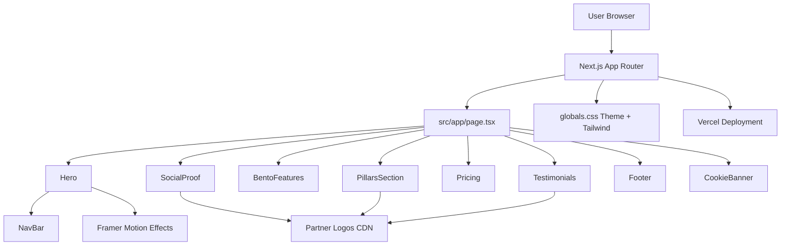

# VocalLabs AI Clone

A modern Next.js landing page inspired by the VocalLabs website, focused on:

- a bold hero section with animated glow lines and waveform-style base layer
- enterprise-focused content blocks and product cards
- smooth motion-driven UI interactions
- Vercel-ready deployment setup

## Live Deployment

- Production URL: https://vocallabs.vercel.app
- Vercel project: sneha-mishras-projects-6ae92617/vocallabs

## Screenshots

Use this section to maintain visual references for future contributors.

Recommended screenshot set:

1. Full homepage (desktop)
2. Hero section (desktop)
3. Mid sections (feature + cards)
4. Footer + cookie banner
5. Full homepage (mobile)


## Screens and Sections

The homepage is built as a single long-form marketing page with these sections:

1. Hero (headline, CTA, animated effects)
2. Partner logos strip
3. Core infrastructure feature bento
4. Reliability and platform cards
5. Enterprise products and links grid
6. Security badges section
7. CTA + multi-column footer
8. Cookie banner

## Tech Stack

- Framework: Next.js 16 (App Router)
- Language: TypeScript
- Styling: Tailwind CSS v4
- Animations: Framer Motion
- Smooth scrolling: Lenis
- Icons: Lucide React

## Project Structure

```text
.
|- public/
|  |- samples/
|  |  |- demo-a.mp3
|  |  \- demo-b.mp3
|  \- vocallabs-logo.png
|- src/
|  |- app/
|  |  |- globals.css
|  |  |- layout.tsx
|  |  \- page.tsx
|  |- components/
|  |  |- landing/
|  |  |  |- BentoFeatures.tsx
|  |  |  |- CookieBanner.tsx
|  |  |  |- Footer.tsx
|  |  |  |- Hero.tsx
|  |  |  |- NavBar.tsx
|  |  |  |- PillarsSection.tsx
|  |  |  |- Pricing.tsx
|  |  |  |- SocialProof.tsx
|  |  |  \- Testimonials.tsx
|  |  \- providers/
|  |- hooks/
|  \- lib/
|- package.json
\- README.md
```

## Architecture Diagram



High-level flow:

- `src/app/page.tsx` composes all landing sections.
- Each section is isolated in `src/components/landing/*` for maintainability.
- Shared styling and animation utilities live in `src/app/globals.css` and `src/lib/*`.
- Static assets are served from `public/*`.
- External visual assets are fetched from VocalLabs CDN URLs where configured.

## Local Development

### 1) Install dependencies

```bash
npm install
```

### 2) Start dev server

```bash
npm run dev
```

Open: http://localhost:3000

### 3) Production build test

```bash
npm run build
npm run start
```

## Available Scripts

- `npm run dev`: run local development server
- `npm run build`: create production build
- `npm run start`: serve production build
- `npm run lint`: run ESLint checks

## Deployment on Vercel

This project is already deployed once, but you can redeploy anytime.

### Option A: Deploy from Vercel Dashboard (recommended)

1. Import the GitHub repository in Vercel.
2. Keep auto-detected Next.js settings.
3. Click Deploy.

### Option B: Deploy from CLI

```bash
npx vercel --prod
```

If asked:

- link to existing project: `vocallabs`
- confirm production deployment

### Production deployment checklist

1. Run `npm run lint`
2. Run `npm run build`
3. Commit and push to `main`
4. Deploy with `npx vercel --prod`
5. Verify output on production URL
6. Smoke-test hero, logo strip, cards, and footer links

## Content and UI Customization Guide

### Main page composition

Edit section order in:

- `src/app/page.tsx`

### Hero content

Edit headline, subheadline, CTA, and background motion in:

- `src/components/landing/Hero.tsx`
- `src/components/landing/NavBar.tsx`

### Partner logos

Edit logo sources in:

- `src/components/landing/SocialProof.tsx`

### Infrastructure and product content

Edit cards and enterprise links in:

- `src/components/landing/BentoFeatures.tsx`
- `src/components/landing/PillarsSection.tsx`
- `src/components/landing/Pricing.tsx`

### Security badges

Edit badge list in:

- `src/components/landing/Testimonials.tsx`

### Footer links and social handles

Edit CTA, columns, and social URLs in:

- `src/components/landing/Footer.tsx`

### Global theme

Edit colors, body background, and global styles in:

- `src/app/globals.css`

## Asset Notes

- Audio samples are stored in `public/samples/`.
- Brand logo is stored in `public/vocallabs-logo.png`.
- Several section images load from external CDN URLs (`https://cdn.vocallabs.ai/...`).

If any external asset fails, replace that URL with a local image in `public/` and update the component list.

## Troubleshooting

### Port issue (`localhost:3000` already in use)

Next.js may switch to another port. Check terminal output and open the printed URL.

### Build passes but page throws runtime errors

Run both checks:

```bash
npm run lint
npm run build
```

Then restart dev server:

```bash
npm run dev
```

### Deployment mismatch after changes

Make sure latest commit is pushed to `main`, then redeploy from Vercel.

### External CDN image not loading

1. Check browser console/network for blocked image URL.
2. Verify the `https://cdn.vocallabs.ai/...` path still exists.
3. Prefer moving critical assets to `public/` for reliability.

## Development Standards Used

- componentized sections for maintainability
- motion accents without blocking readability
- responsive layout for desktop and mobile
- build-validated before deploy

## Contribution Workflow

Use this workflow for clean collaboration.

### Branch strategy

- `main`: stable and deployable
- feature branches: `feature/<short-name>`
- fix branches: `fix/<short-name>`

Examples:

- `feature/add-mobile-nav`
- `fix/footer-link-targets`

### Commit message convention

Use concise imperative commit messages:

- `feat: add enterprise security badge grid`
- `fix: correct bento icon import causing runtime error`
- `docs: expand README deployment instructions`

### Pull request checklist

Before creating/merging PR:

1. Code builds locally (`npm run build`)
2. Lint passes (`npm run lint`)
3. No broken links in nav/footer
4. Mobile and desktop visual checks done
5. README updated if behavior or structure changed

### Review focus areas

- visual consistency with existing theme
- section-level responsiveness
- performance (avoid heavy assets in critical path)
- accessibility basics (alt text, semantic structure)

## License and Ownership

This repository is a clone-style implementation for learning/demo purposes. 
Before commercial usage, verify content ownership, logo rights, and hosted asset permissions.
